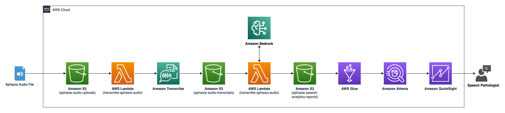

# aphasia-speech-analytics

## Background

Aphasia is a chronic disability that affects a persons ability to talk, understand what is being said to them, read information, and write. More than 140,000 people are living with Aphasia in Australia. This number is expected to grow to over 300,000 by 2050.

Professor David Copland from the Queensland Aphasia Research Center (QARC) approached the AWS team at Brisbane, Australia with this problem statement:

> "What if we could measure the day to day ‘verbal fitness’ of people living with aphasia and provide this as a weekly dashboard / report to speech pathologists?"

This is an AWS SAM app that uses Amazon Transcribe APIs to transcribe speech samples of persons living with Aphasia in S3 Objects to determine "verbal fitness" or legibility of speech. Additionally, it also analyses the semantics of the speech using Amazon Bedrock APIs with Anthropic's LLM, Claude 2. The app produces three reports for each patient: word report, summary report and virtual speech pathology report and stores them in an S3 bucket.

## Architecture Diagram



## Requirements

- AWS CLI
- [Python 3.6 installed](https://www.python.org/downloads/)
- [Docker installed](https://www.docker.com/community-edition)
- [Python Virtual Environment](http://docs.python-guide.org/en/latest/dev/virtualenvs/)

## CLI Commands to package and deploy the application

CLI commands to package, deploy and describe outputs defined within the cloudformation stack.

First, we need an `S3 bucket` where we can upload our Lambda functions packaged as ZIP before we deploy anything - If you don't have a S3 bucket to store code artifacts then this is a good time to create one:

```bash
aws s3 mb s3://BUCKET_NAME
```

Next, run the following command to package your Lambda function. The `sam package` command creates a deployment package (ZIP file) containing your code and dependencies, and uploads them to the S3 bucket you specify.

```bash
sam package \
    --template-file template.yaml \
    --output-template-file packaged.yaml \
    --s3-bucket REPLACE_THIS_WITH_YOUR_S3_BUCKET_NAME
```

The `sam deploy` command will create a Cloudformation Stack and deploy your SAM resources.

```bash
sam deploy \
    --template-file packaged.yaml \
    --stack-name aphasia-speech-analytics \
    --capabilities CAPABILITY_IAM \
    --parameter-overrides MyParameterSample=MySampleValue
```

To see the names of the S3 bucket and DynamoDB table created after deployment, you can use the `aws cloudformation describe-stacks` command.

```bash
aws cloudformation describe-stacks \
    --stack-name aphasia-speech-analytics --query 'Stacks[].Outputs'
```
